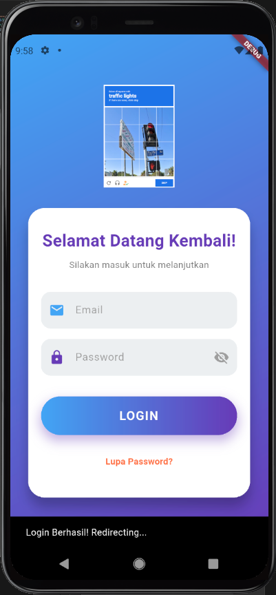
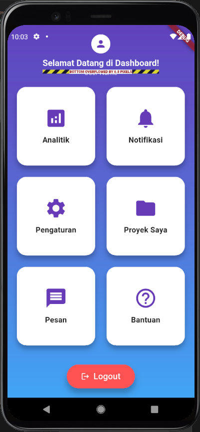

# Proyek Halaman Login & Dashboard Flutter (Versi Simulasi AI)

## Deskripsi Proyek

Proyek Flutter ini adalah implementasi halaman login dan dashboard yang dirancang untuk memenuhi persyaratan tugas, dengan fokus pada demonstrasi potensi kode yang dihasilkan oleh alat bantu AI. Versi ini mensimulasikan bagaimana sebuah AI (seperti ChatGPT atau Copilot) dapat menyusun kode UI Flutter yang fungsional, responsif, dan memiliki estetika modern.

Tujuannya adalah untuk menunjukkan efisiensi AI dalam menghasilkan kode boilerplate dan desain UI yang kompleks, sekaligus menyoroti praktik terbaik dalam pengembangan aplikasi Flutter.

## Tampilan Aplikasi

Berikut adalah beberapa tangkapan layar dari aplikasi ini:

### Halaman Login (Versi Simulasi AI)
<!-- Sisipkan screenshot halaman login di sini. Contoh: -->
<!--  -->

### Halaman Dashboard (Versi Simulasi AI)
<!-- Sisipkan screenshot halaman dashboard di sini. Contoh: -->
<!--  -->

## Fitur Utama (Versi Simulasi AI)

### Halaman Login (`login_page_ai.dart`)
*   **Desain Modern:** Antarmuka yang menarik dengan latar belakang gradient dinamis dan formulir login yang ditempatkan dalam kartu yang menonjol.
*   **Validasi Formulir:** Input email dan password dengan validasi real-time.
*   **Toggle Visibilitas Password:** Pengguna dapat menampilkan atau menyembunyikan password untuk kemudahan input.
*   **Animasi Tombol:** Tombol login memiliki animasi skala (mengecil saat ditekan) untuk memberikan umpan balik interaktif yang halus.
*   **Responsif:** Menggunakan `MediaQuery` untuk menyesuaikan tata letak dan ukuran elemen secara otomatis berdasarkan ukuran dan orientasi layar.
*   **Logo Aplikasi:** Penempatan logo yang jelas di bagian atas formulir sebagai identitas aplikasi.
*   **Navigasi:** Setelah login berhasil, pengguna akan diarahkan ke halaman dashboard menggunakan `Navigator.pushReplacementNamed`.

### Halaman Dashboard (`dashboard_page_ai.dart`)
*   **Desain Modern & Interaktif:** Latar belakang gradient yang kohesif dengan halaman login, memberikan pengalaman pengguna yang mulus.
*   **SliverAppBar Dinamis:** `AppBar` yang diperluas dengan sapaan personal dan avatar, serta kemampuan untuk menyusut (collapse) saat di-scroll, menampilkan judul dan avatar kecil untuk efisiensi ruang.
*   **Kartu Fungsional:** Tampilan grid berisi kartu-kartu informatif (misalnya Analitik, Notifikasi, Pengaturan, Proyek, Pesan, Bantuan) dengan ikon dan judul yang jelas, dapat diklik untuk aksi lebih lanjut (saat ini hanya menampilkan SnackBar).
*   **Layout Responsif:** Tata letak kartu menyesuaikan jumlah kolom berdasarkan lebar layar (2 kolom untuk layar kecil, 3 kolom untuk layar besar), memastikan tampilan optimal di berbagai perangkat.
*   **Tombol Logout:** Tombol logout yang menonjol dengan desain modern dan efek visual yang menarik.

## Kredensial Demo

Untuk menguji fungsionalitas login, gunakan kredensial berikut:

*   **Email:** `user@example.com`
*   **Password:** `password123`

## Struktur Proyek